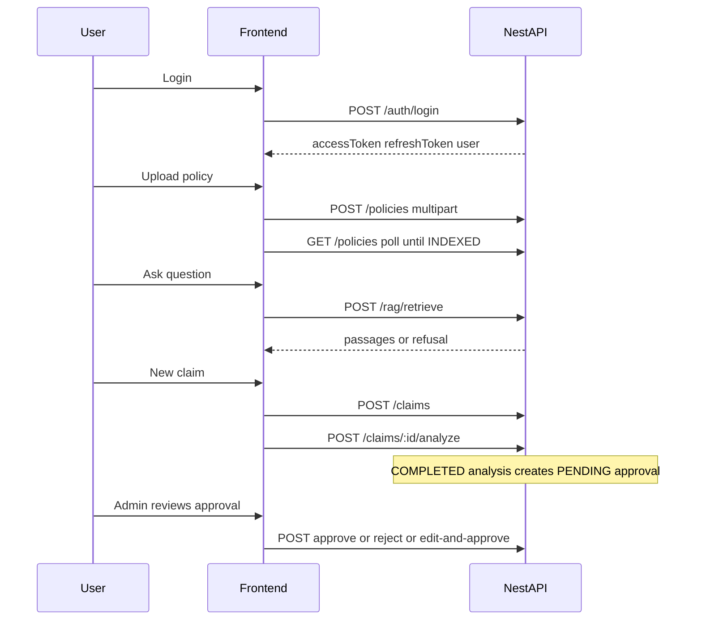

# System design — Part B (MVP shipped)

This document describes what the **frontend** MVP actually implements against the Nest API. It is not a product roadmap.

## Stack

| Layer | Choice |
| --- | --- |
| UI | React 19, TypeScript, MUI 9, Emotion |
| Bundler | Vite 8 |
| Routing | `react-router-dom` (`src/routes`) |
| Data | TanStack Query + Axios (`src/config/axios`, `src/config/queryBase`) |
| i18n | `i18next` / `react-i18next` (Arabic default, English toggle) |
| Auth state | `localStorage` tokens + `AuthProvider` |

Entry: `index.html` → `src/main.tsx` → `MainProvider` (Query + Auth + Theme + i18n) → `App` → routes.

## End-to-end flow

## MVP modules

### Auth

- Login and refresh: `src/feature/auth/api.ts`
- Session helpers and JWT expiry decode: `src/feature/auth/session.ts`
- Proactive refresh timer: `src/provider/AuthProvider.tsx`
- Axios attaches `Authorization: Bearer …` and retries once after refresh on `401` (except login/refresh): `src/config/axios/apis.ts`

### Policies (Documents)

- List, multipart create, delete: `src/feature/policies/api.ts`
- UI: `src/feature/pages/DocumentsPage.tsx`, upload dialog, table with status / stage / file link
- While any row is `UPLOADED` or `PROCESSING`, the list refetches every 10 seconds

### Ask (retrieval only)

- `POST /rag/retrieve` with `topK: 5` and `language: AUTO`: `src/feature/rag/api.ts`
- UI shows hit passages and citations, or the API refusal message: `src/feature/pages/AskPage.tsx`
- No LLM answer generation on the frontend

### Claims

- Types, list (paged), create, analyze: `src/feature/claims/api.ts`
- List page: `src/feature/pages/ClaimsPage.tsx`
- New claim: form from `GET /policies/options` and `GET /claims/types`, then create + analyze on the same page with an analysis panel: `src/feature/pages/NewClaimPage.tsx`

### Approvals (admin)

- List, detail, approve, reject, edit-and-approve: `src/feature/approvals/api.ts`
- Queue and review UI: `src/feature/pages/ApprovalsPage.tsx`, `src/feature/pages/ApprovalReviewPage.tsx`
- Employees receive `403` and see an unauthorized message; the nav link stays visible

### Dashboard

- Three live tables (limit 5): policies, claims, approvals — `src/feature/pages/dashboard/DashboardTables.tsx`
- Approvals section shows an admin-only note when the list call is forbidden

## Gap table (honest)

| Area | Current state | Gap / not in MVP |
| --- | --- | --- |
| Natural-language answers | Ask page returns retrieved passages or a refusal from `/rag/retrieve` | No generated answer; no chat model call on the SPA |
| Frontend route guards | Pages are reachable by URL; API enforces roles and ownership | No client-side role-based route protection or redirect |
| Approvals for employees | UI shows unauthorized; API returns `UNAUTHORIZED_REVIEWER` | No employee review workflow |
| Claim update | Create + analyze + list exist | No UI for `PATCH /claims/:id` |
| Analysis history | Latest run shown after create/analyze | No dedicated “load latest analysis” screen or history list |
| Chat persistence | Ask thread is in component state | Refresh clears the conversation |
| Users admin | Login uses seeded accounts | No UI for `POST/GET /users` |
| Frontend tests | Lint and TypeScript build exist | No unit/e2e test suite in this repo |
| Production deploy | Local Vite + Nest assumed | No hosting, HTTPS, or hardened cookie/session story |
| Auth storage | Access and refresh tokens in `localStorage` | XSS-sensitive; not production-hardening |
| Offline / mock data | Dashboard and domain pages use the API | Dead local sample stores must not be treated as product features |

## Out of scope for Part B

Anything not listed under **MVP modules** above is out of scope for this frontend deliverable, including backend indexing internals, embedding model choice, and production observability.
